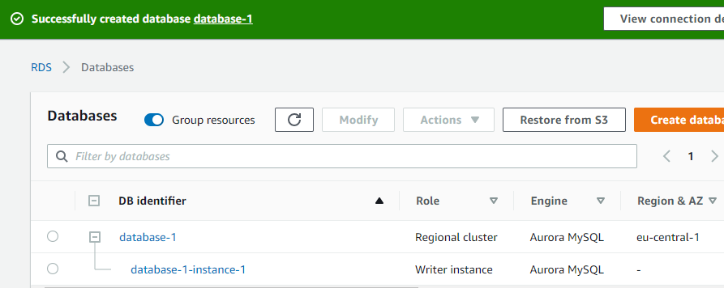
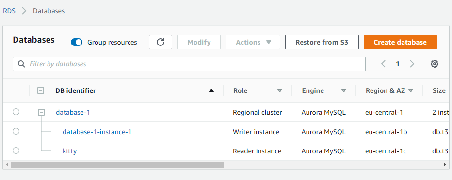
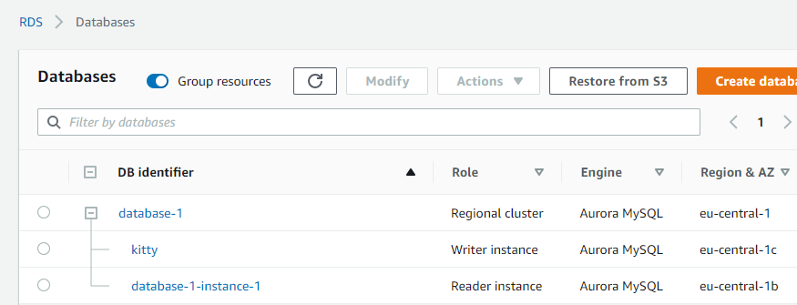
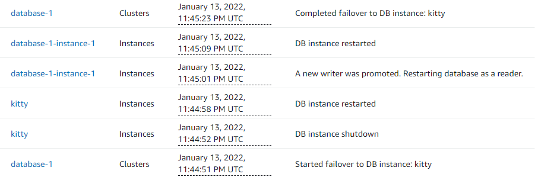

# RDS and Aurora

Amazon Relational Database Service (RDS also known as SQL) is available on several database instance types - and provides six database engines to choose from: 

* PostgreSQL, MySQL, MariaDB 
-open source, low cost, low performance

* Oracle Database, and Microsoft SQL Server 
-commercial, high performance, high cost

* Amazon Aurora 
-Amazon's native database engine, designed explicitly with AWS cloud. It provides performance on par with commercial databases at 1/10th the cost on par with open source databases. *Can only migrate MySQL and PostgresSQL databases. Otherwise must use RDS. 

While RDS and Aurora requires depoloyment from smaller to larger instances as needs change, **Aurora Serverless** handles automatic scaling. It's on demand pricing model may be higher, but it could be a good fit for variable and unpredictable workloads, enterprise database management, SaaS applications, or scaled-out databases across multiple servers.

## Key-terms
[MySQL]()

[PostgreSQL]()

[Failover]()

[Aurora Read Replica]()

## Assignment
**Create a high-availability database cluster with Amazon Aurora**

This lab focuses on how to configure an Amazon Aurora cluster to create a high-availability database. A high-availability database consists of compute nodes replicated across multiple availability zones to gain increased read scalability and failover protection. 

By default, an Amazon Aurora cluster has only one primary compute instance performing read/write operations. By adding one or more Aurora Replicas to the cluster, read scalability and high availability is gained for the database cluster. If the primary instance in the cluster fails, Aurora automatically promotes an existing Replica to be the new primary instance.

Generally, Aurora replicas should be created in a different Availability Zone (AZ) than the primary instance. This way, the database can quickly fail over to the Replica in the other AZ in the event of infrastructure problems in the primary AZ.

At the storage layer, Aurora always protects data by replicating it six ways across three AZs. However, if no Aurora Replicas were added to the cluster, there is latency for Aurora to create a new replacement primary instance when a failure is detected.

This tutorial will use Amazon Aurora with MySQL compatibility. You will create an Aurora Cluster via the Amazon RDS Management Console, add an Aurora Replica, test a failover scenario, and then terminate the tutorial environment.

### References
https://aws.amazon.com/rds/

https://aws.amazon.com/rds/aurora

https://aws.amazon.com/rds/aurora/serverless/

https://aws.amazon.com/getting-started/hands-on/create-high-availability-database-cluster/

https://aws.amazon.com/getting-started/hands-on/migrate-rdsmysql-to-auroramysql/?trk=gs_card

https://docs.aws.amazon.com/AmazonRDS/latest/AuroraUserGuide/Aurora.CreateInstance.html

https://aws.amazon.com/rds/aurora/getting-started/

https://searchcloudcomputing.techtarget.com/answer/When-should-I-use-Amazon-RDS-vs-Aurora-Serverless

### Issues

### Results

1) Create an Amazon Aurora cluster comprised of one Aurora database instance. 

2) Create an Aurora replica for high availability.
*You can increase compute availability by adding Read Replicas in different Availability Zones (AZs) within an AWS region. Up to 15 Aurora Replicas can be distributed within a region.*

3) Test database failover

3) Terminate resources!