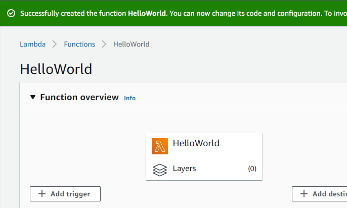
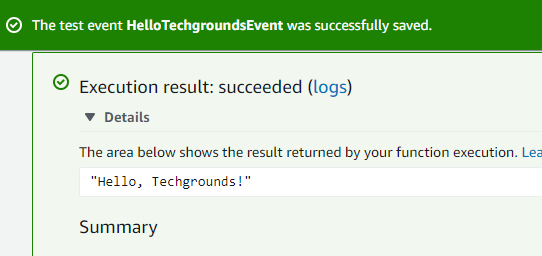
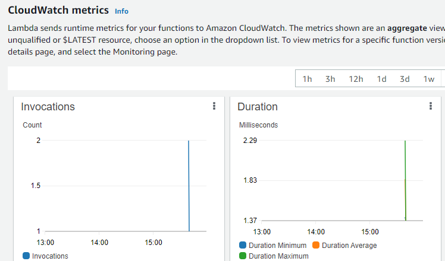

# AWS Lambda
AWS Lambda is a serverless, **event-driven** compute service that runs code for virtually any type of application or backend service without provisioning or managing servers. Trigger Lambda from over 200 AWS services and software as a service (SaaS) applications. 

What is AWS Lambda vs EC2?
Lambda is perfect for event driven programming, while EC2 is ideal when a more tailored solution is needed. EC2 will give an actual OS to work with, such as Linux or Windows, while Lambda will simply perform a function as a service.

Features of Lambda:
* Process data at scale
* Run interactive web and mobile backends
* Enable powerful Machine Learning ML insights
* Create event-driven applications

## Key-terms
[Handler](beschrijvingen/aws-cloud-glossary.md#handler)

## Assignment
In this tutorial guide through the basics of running code on AWS Lambda without provisioning or managing servers. It will walk through how to create a Hello World Lambda function using the AWS Lambda console. Then how to manually invoke the Lambda function using sample event data and review the output metrics.

### References

https://aws.amazon.com/lambda/

https://aws.amazon.com/getting-started/hands-on/run-serverless-code/

https://aws.amazon.com/getting-started/hands-on/building-serverless-applications-with-amazon-aurora-serverless/

https://zacks.one/aws-lambda-lab/

### Issues

### Results

1) Create a Lambda function by using a Blueprint template.

2) Configure and create Lambda function.
* A Lambda function consists of code that user provides, associated dependencies, and configuration. The configuration information you provide includes the compute resources wanted to allocate (for example, memory), execution timeout, and an IAM role that AWS Lambda can assume to execute Lambda function.

3) Configure memory, timeout, and VPC settings.

4) Invoke Lambda function and verify results.
*The console shows the hello-world-python Lambda function - you can now test the function, verify results, and review the logs.

5) Monitor metrics
*AWS Lambda automatically monitors Lambda functions and reports metrics through Amazon CloudWatch.*

*The Monitoring tab will show six CloudWatch metrics: Invocation count, Invocation duration, Invocation errors, Throttled invocations, Iterator age, and DLQ errors.*

*With AWS Lambda, you pay for what you use. After you hit your AWS Lambda free tier limit, **you are charged based on the number of requests for your functions (invocation count) and the time your code executes (invocation duration).***

6) Clean up and delete Lambda function.
*While there is no charge for keeping Lambda functions, it is easily deleted from the AWS Lambda console.*

