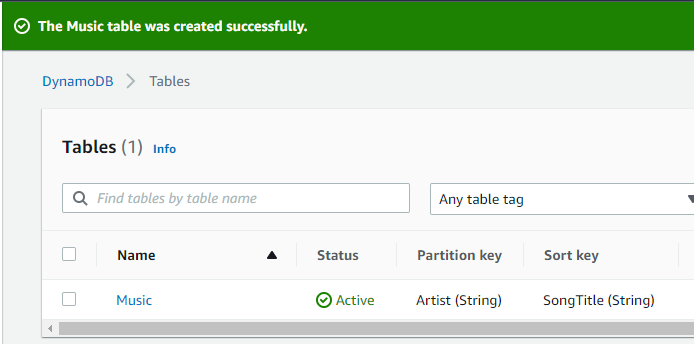
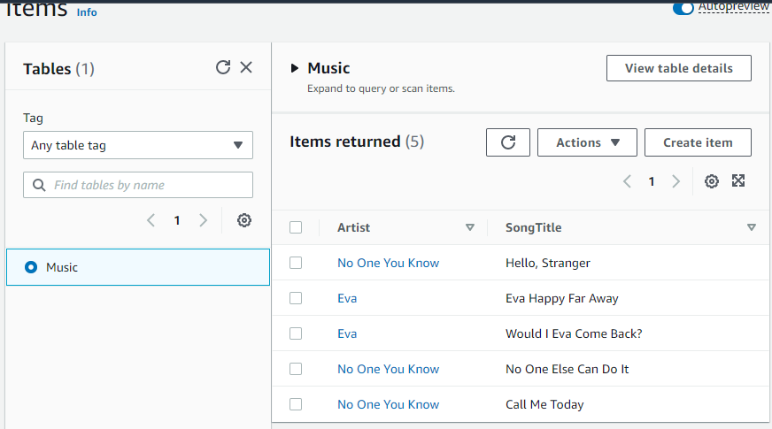
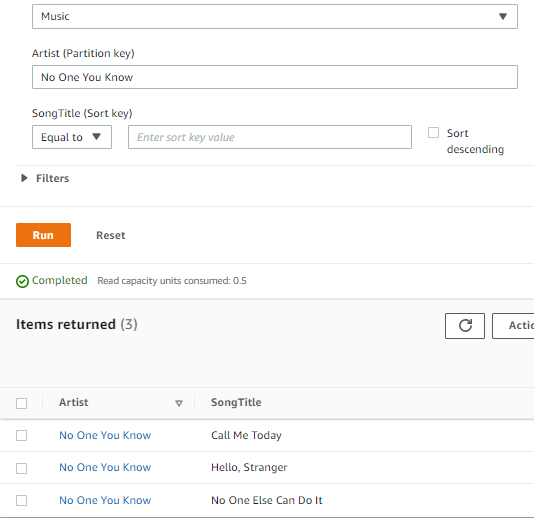
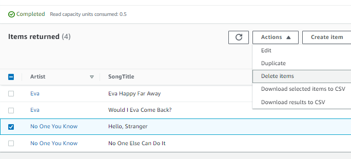
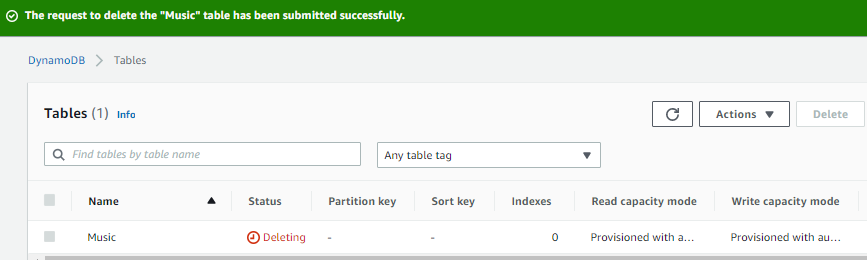

# DynamoDB
Amazon DynamoDB is a fully managed, serverless, key-value NoSQL database designed to run high-performance applications at any scale, that would overburden traditional relational databases. DynamoDB offers built-in security, continuous backups, automated multi-region replication, in-memory caching, and data export tools. 

DynamoDB is non relational database that supports **document store** and **key-value store** models.

DynamoDB features:
* Global tables
* Point-in-time recovery
* NoSQL Workbench
* DynamoDB Accelerator (DAX)

Relational database systems (RDBMS) and NoSQL databases have different strengths and weaknesses:

In RDBMS, data can be queried flexibly, but queries are relatively expensive and don't scale well in high-traffic situations (see First Steps for Modeling Relational Data in DynamoDB).

In a NoSQL database such as DynamoDB, data can be queried efficiently in a limited number of ways, outside of which queries can be expensive and slow.

These differences make database design different between the two systems:

* In RDBMS, design is for flexibility without concern about implementation details or performance. Query optimization generally doesn't affect schema design, but normalization is important.

* In DynamoDB, the design schema is to make the most common and important queries as fast and as inexpensive as possible. Data structures are tailored to the specific requirements of business use cases.

**General principles and design patterns to model data efficiently in DynamoDB (NoSQL)**

1) Identify the specific query patterns that the system must satisfy.

Three fundamental properties of application's access patterns considered before starting:

a- Data size: Knowing how much data will be stored and requested at one time will help determine the most effective way to partition the data.

b- Data shape: Instead of reshaping data when a query is processed (as an RDBMS system does), a NoSQL database organizes data so that its shape in the database corresponds with what will be queried. This is a key factor in increasing speed and scalability.

c- Data velocity: DynamoDB scales by increasing the number of physical partitions that are available to process queries, and by efficiently distributing data across those partitions. Knowing in advance what the peak query loads will be might help determine how to partition data to best use I/O capacity.

2) Organize data according to general principles that govern performance:

a- Keep related data together.
Key in NoSQL systems today, where keeping related data in close proximity has a major impact on cost and performance. Instead of distributing related data items across multiple tables, keep related items in the NoSQL system as close together as possible.

b- As a general rule, maintain as few tables as possible in a DynamoDB application.
Exceptions are high-volume time series data are involved, or datasets that have very different access patterns. 

c- Use sort order.   
Related items can be grouped together and queried efficiently if their key design causes them to sort together. This is an important NoSQL design strategy.

d- Distribute queries.   
It is also important that a high volume of queries not be focused on one part of the database, where they can exceed I/O capacity. Instead, design data keys to distribute traffic evenly across partitions as much as possible, avoiding "hot spots".

5) Use global secondary indexes.   
By creating specific global secondary indexes, this enables different queries than the main table can support, yet are still fast and inexpensive.

To put it simply, unlike RDMBS, NoSQL designs by first considering data I/O throughput, then designs the data tables to make it most efficient. 

## Key-terms
[NoSQL](beschrijvingen/general-glossary.md#nosql)

[Encryption at Rest](beschrijvingen/general-glossary.md#encryption-at-rest)

[Partition Key](beschrijvingen/general-glossary.md#partition-key)

[Sort Key](beschrijvingen/general-glossary.md#sort-key)

## Assignment
Using the AWS DynamoDB console to
create a simple table, add data, scan and query the data, delete data, and delete the table.

### References
https://aws.amazon.com/dynamodb/

https://aws.amazon.com/getting-started/hands-on/create-nosql-table/

### Issues

### Results

1) Create a NoSQL Table

2) Add data to the NoSQL Table

3) Query the NoSQL Table

4) Delete an Existing Item

5) Delete a NoSQL Table
Delete unused tables to avoid costs.

