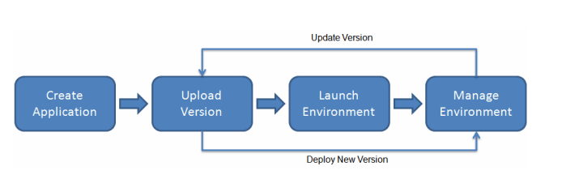

# Elastic Beanstalk
Elastic Beanstalk is a Platform as a Service (PaaS) which automatically handles the deployment details of a full-blown application. Networking and infrastructure work is handled and scaled automatically. However, some aspects of the infrastructure can be self managed. Elastic Beanstalk automatically handles the details of capacity provisioning, load balancing, scaling, and application health monitoring.

 This allows for:

* Developer productivity - developers does not have to spend time on infrastructure, just work on code and deploy application.

* Impossible to outgrow - complete scalability and pricing efficiency.

* Complete resource control - user can control all aspects of the beanstalk as desired.

Elastic Beanstalk is configured by using the Elastic Beanstalk console, the AWS Command Line Interface (AWS CLI), or eb, a high-level CLI designed specifically for Elastic Beanstalk.

*More expensive than Lambda, but is a full PaaS and more versatile for full application deployment when full infrastructure control is necessary or using a language that Lambda does not yet support.. Lambda is considered a Function as a Service (micro-service), where AWS will execute only a piece of code, and as many times as desired triggered by an event. Perhaps Lambda may phase out Beanstalk entirely.

### References
https://aws.amazon.com/elasticbeanstalk/

https://docs.aws.amazon.com/elasticbeanstalk/latest/dg/Welcome.html

