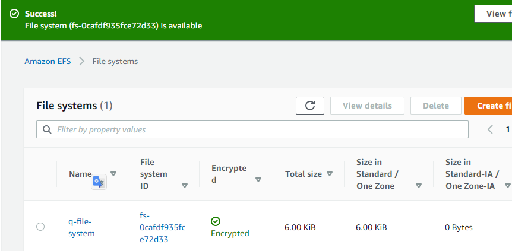
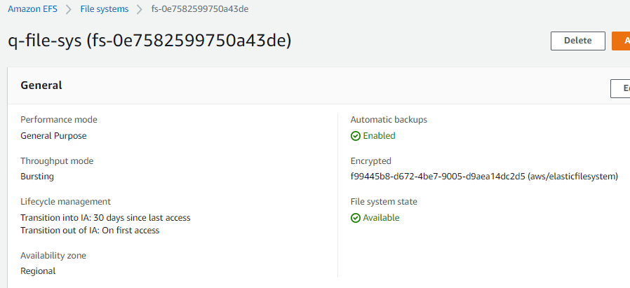
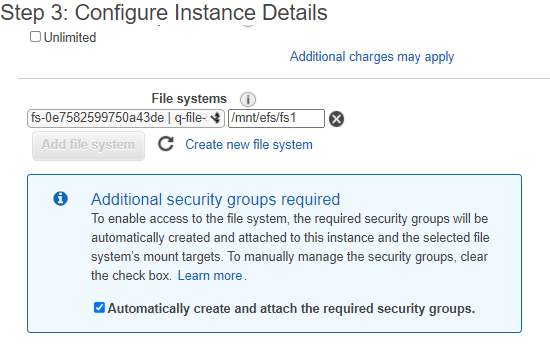
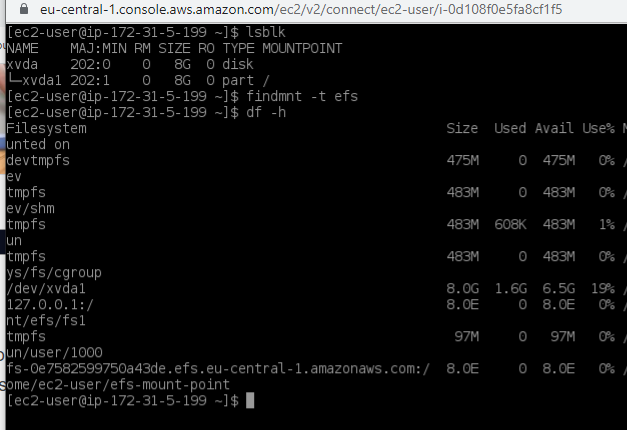
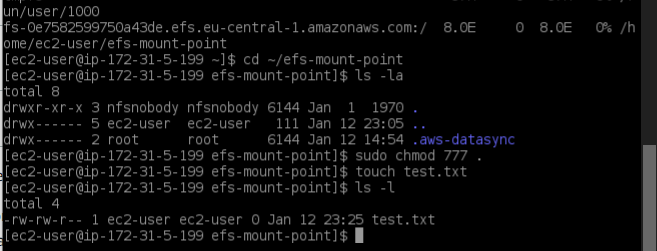
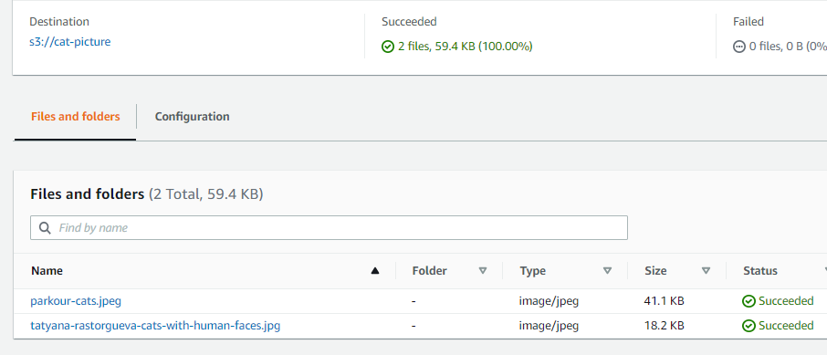
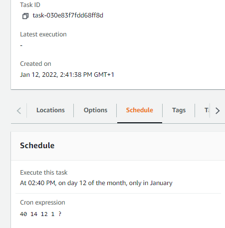

# Elastic File System EFS
Amazon Elastic File System (EFS) automatically grows and shrinks as files are added or removed.

With Amazon EFS:
1) create a file system

2) mount the file system on an Amazon EC2 instance

3)  read and write data to and from the file system.

**Features of EFS:**

* Amazon EFS file systems using Standard storage classes store data and metadata across multiple Availability Zones in an AWS Region. 

* can grow to petabyte scale, drive high levels of throughput, and allow massively parallel access from compute instances to the data.

* provides file system access semantics, such as strong data consistency and file locking. 

* enables control access to file systems through Portable Operating System Interface (POSIX) permissions. 

* supports authentication, authorization, and encryption capabilities to help meet security and compliance requirements.Supports two forms of encryption for file systems, encryption in transit and encryption at rest. 

Range of storage classes for different use cases:

* **EFS standard storage class** - regtional storage class for frquently accessed data.
* **EFS infrequent access** - regional storage class for infrequently accessed files.

* **EFS One Zone (and One Zone-IA)** - lower cost storage within a single Availability Zone in an AWS Region.

**EFS is effectively cheaper than EBS**
EBS has a lower price per GB-month compared to EFS—$0.10 for EBS vs $0.34 for EFS. However, that payment is per EFS share and not per machine instance, so the cost of using EFS decreases when more machines are accessing EFS. With EBS, there is a cost for each machine instance with its own separate, dedicated storage volume. So in most scenarios, EFS will be substantially cheaper.

## Key-terms
[Mount Target](../beschrijvingen/aws-cloud-glossary.md#mount-target)

[Access Points](../beschrijvingen/aws-cloud-glossary.md#access-points)

[Security Groups](../beschrijvingen/aws-cloud-glossary.md#security-groups)

[DataSync](../beschrijvingen/aws-cloud-glossary.md#datasync)

[Network File System](../beschrijvingen/general-glossary.md#network-file-system)

## Assignment

In this Getting Started exercise, you can learn how to quickly create an Amazon Elastic File System (Amazon EFS) file system. As part of this process, you mount your file system on an Amazon Elastic Compute Cloud (Amazon EC2) instance in your virtual private cloud (VPC). You also test the end-to-end setup.

1) Create your Amazon EFS file system.

2) Create your Amazon EC2 resources, launch your instance, and mount the file system.

3) Transfer files to your EFS file system using AWS DataSync.

4) Clean up your resources and protect your AWS account.

### References
https://aws.amazon.com/efs/

https://docs.aws.amazon.com/efs/latest/ug/how-it-works.html

https://docs.aws.amazon.com/efs/latest/ug/getting-started.html

https://docs.aws.amazon.com/efs/latest/ug/mounting-fs-old.html

https://docs.aws.amazon.com/efs/latest/ug/gs-step-four-sync-files.html

### Issues
**AWS Note**
You can't use Amazon EFS with Microsoft Windows–based Amazon EC2 instances. 
**This means only Linux is supported.** Any Linux-based EC2 machine can mount a folder stored on EFS as a local drive, using NFS. Access to files is secured using POSIX permissions. 

**Default security group not configured for SSH**
You can't access your EC2 instance by Secure Shell (SSH) using this security group. SSH access isn't required for this exercise. To add access by SSH later, you can edit the default security and add a rule to allow SSH. Or you can create a new security group that allows SSH. You can use the following settings to add SSH access:

Type: SSH

Protocol: TCP

Port Range: 22

Source: Anywhere 0.0.0.0/0

### Results

1) Open the Amazon EFS Management Console to create a file system 
https://console.aws.amazon.com/efs/

.

2) Create and Launch EC2. Configure default security group to allow incoming SSH. Connect to EC2 through SSH Linux. Install nfs-utils. Mount EFS to EC2 with a DNS name.

**Note**
If you choose Amazon Linux AMI 2016.03.0 or Amazon Linux AMI 2016.09.0 when launching your Amazon EC2 instance, you don't need to install nfs-utils because it's already included in the AMI by default.

.

.

.

3) Transfer files to Amazon EFS using AWS DataSync  
.

a- create S3 bucket with two cat images as source for DataSync

b- configure source location for S3 bucket

c- configure destination location for efs

d- configure task settings. Scheduled with a cronjob

e- start task

4) Clean up

## Datasync executed but unable to verify 2 cat image files in the efs at the mount point. So can add files to the efs, but not able to transfer files to the efs from another source. To be continued....

