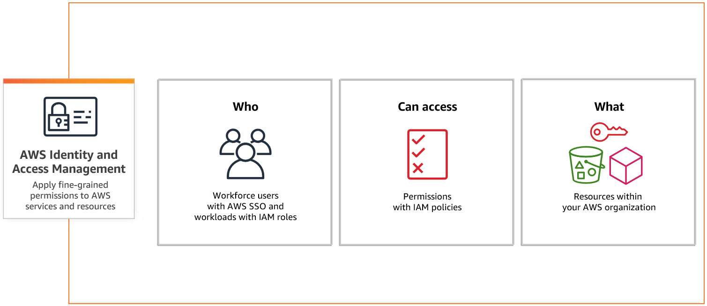

# Identity and Access Management IAM
 AWS Identity and Access Management (IAM) provides fine-grained access control across all of AWS. With IAM, specify who can access which services and resources, and under which conditions. With IAM policies, manage permissions to the workforce and systems to ensure least-privilege permissions.

IAM is a feature of an AWS account and is offered at no additional charge.

With IAM, you define who can access what by specifying fine-grained permissions. IAM then enforces those permissions for every request. Access is denied by default and access is granted only when permissions specify an "Allow." 

## Key-terms
[Least-privilege Permissions]()

[Multi-factor Authentication]()

## Assignment

1) Create a new user
2) Create a new group, and assign user in a group
3) Use the group to assign policies
4) Assign MFA for user
5) Create account Alias

### References

https://aws.amazon.com/iam

https://www.youtube.com/watch?v=3y596T1eH_8

### Issues

### Results

1) Create new user

2) Create new group with admin access policy

3) Use groups to assign policies.

User has too many policies attached, hard to manage.
Detach redundant admin access policy from indivdiual user. The admin access policy is given under the group, to which the user is now assigned.

4) Assign MFA for user using Authy (digitalal key)

5) Change password policy so user group can change their own password.

6) Create and use an alias account instead of the root account. 
Create an Alias called "vinkeveen". Log into alias url, go through MFA, using .csv password, change password to personal one. Use this alias log-in from now on. 

