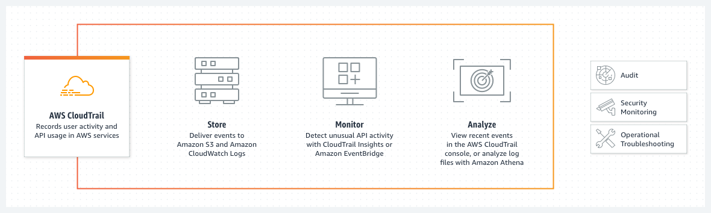

# CloudTrail
 AWS CloudTrail monitors and records user activity across AWS infrastructure, allowing control over storage, analysis, and remediation actions.

CloudTrail is enabled when it is created on the AWS account. When activity occurs in the AWS account, that activity is recorded in a *CloudTrail event*. Events can be viewed in the CloudTrail console by going to *Event history*.

* Event history allows user to view, search, and download the past 90 days of activity in the AWS account. 

* Create a *CloudTrail trail* to archive, analyze, and respond to changes in the AWS resources. 
  -A trail is a configuration that enables delivery of events to an Amazon S3 bucket that is specified. 

* Deliver and analyze events in a trail with *CloudWatch Logs* and *CloudWatch Events*. 

Two types of trails can be created for an AWS account:

1) A trail that applies to all regions

 - When a trail created applies to all regions, CloudTrail records events in each region and delivers the CloudTrail event log files to a specified S3 bucket. If a region is added after you create a trail that applies to all regions, that new region is automatically included, and events in that region are logged. An all-regions trail is the default option as best practice. 
 
 *A single-region trail can be updated to log all regions only by using the AWS CLI.*

2) A trail that applies to one region

 - When a created trail applies to only one region, CloudTrail records the events in that region only. It then delivers the CloudTrail event log files to a specified Amazon S3 bucket.
 
 *A single-region trail can only be created by using the AWS CLI.*

*Cloudwatch is a monitoring service that gives visibility into the performance and health of AWS resources and applications, whereas Cloudtrail is a service that logs AWS account activity and API usage for risk auditing, compliance and monitoring.*

Access CloudTrail via AWS CLI, the CloudTrail API, or [CloudTrail console](https://aws.amazon.com/cloudtrail/)

### References
https://aws.amazon.com/cloudtrail/

https://cloudcompiled.com/blog/cloudwatch-cloudtrail-difference/

https://docs.aws.amazon.com/awscloudtrail/latest/userguide/how-cloudtrail-works.html

