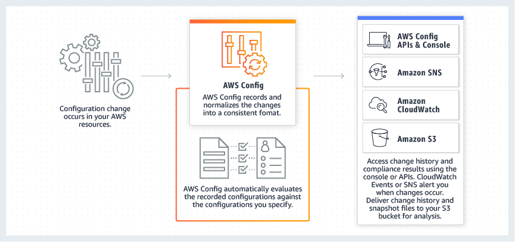

# Config
Lists of questions for theoretical research:
What is X for?
How does X fit / replace X in a classical setting?
How can X be combined with other services?
What is the difference between X and other similar services?

AWS Config is a service that enables an organization to assess, audit, and evaluate the configurations of AWS resources.

* Config continuously monitors and records AWS resource configurations and allows automation of the evaluation of recorded configurations against desired configurations. 

* Config allows review of changes in configurations and relationships between AWS resources, detailed resource configuration histories, and overall compliance against the configurations specified within organizational internal guidelines. 

This simplifies compliance auditing, security analysis, change management, and operational troubleshooting.

*Note that **Trusted Advisor** gives  broad but fixed checks to follow AWS best practices. **Config** is highly customizable for individual organizational practices, also integrating with Lambda to take automated action when a resource violates a rule. **Inspector** checks best practices inside of an EC2 instance (which Config does not)* 

Access via [Config console](https://console.aws.amazon.com/config?p=cfg&cp=bn&ad=c)

### References
https://aws.amazon.com/config/

https://towardsaws.com/aws-trusted-advisor-vs-aws-config-vs-aws-inspector-4a952bac38ec