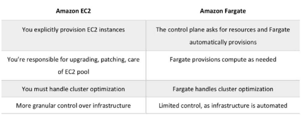

# Elastic Container Service ECS

Companies initially build and deploy their applications in a monolithic design, but as they grow and offer more features, they migrate towards a microservicdes model and containerize different parts of their applications. Effectively isolating different parts of their services so that while all is running simultaneously, each component can be updated or changed without without affecting other components.

Traditionally, a virtual machine (EC2) is used to deploy an application. By containerizing the entire application and it's runtime dependencies, now multiple lightweight containers (cluster) can run on one EC2, thus sharing one OS, instead of deploying multiple EC2, each with its own OS. Containers is more resource efficient. 

AWS Elastic Container Service ECS provides container management like Google's open-source Kubernetes. AWS also offers a natively integrated Kubernetes management console (EKS)

Amazon ECS makes it easy to deploy, manage, and scale Docker containerized:
* (long-running) applications 
* services 
* batch processes 
* ETL workloads 
* microservices 
* machine learning apps

Containers may include:
* Web servers
* App servers
* Queues
* Background workers
* Caches
* API Backends
* Databases

**Features of Amazon ECS**

Amazon ECS is a regional service across multiple Availability Zones. Amazon ECS clusters can be created within a new or existing VPC. After a cluster is up and running, create task definitions that define which container images will run across the clusters. The task definitions are used to run tasks or create services. Container images are stored in and pulled from container registries (like ECR)

Containers are defined in a task definition that is used to run **tasks** within a service. In this context, a **service** is a configuration that runs and maintains a specified number of tasks simultaneously in a **cluster**. 

Amazon ECS uses **simple API calls** to launch and stop container-based applications and query the complete state of clusters. 
*Or can configure it through self management and **schedule** the placement of containers acros clusters.*

ECS is integrated with features such as EC2, Elastic Load Balancing, security groups, EBS volumes, and IAM roles. 

There are two ECS launch types which determines the type of infrastructure on which task services are hosted: EC2 and Fargate

* Tasks and services can be run on a serverless infrastructure that is managed by AWS Fargate, which places containers across clusters based on resource needs. (*Fargate can manage EKS and ECS, and offers more flexiblity than Lambda, but less than EC2*)

* Alternatively, for more control over the infrastructure, run tasks and services on a cluster of Amazon EC2 instances.

*No additional charge to use ECS to manage containers. Only pay for EC2, fee services, and Fargate consumption.*

## Key-terms
[Container](beschrijvingen/general-glossary.md#container)

[Docker](beschrijvingen/general-glossary.md#docker)

[Kubernetes](beschrijvingen/general-glossary.md#kubernetes)

[Elastic Kubernetes Service](beschrijvingen/aws-cloud-glossary.md#elastic-kubernetes-service)

[Fargate](beschrijvingen/aws-cloud-glossary.md#fargate)

[Cluster]()

[Container as a Service]()

[Monolith]()

[Microservice]()

[Extract-Transform-Load Workloads]()

[Elastic Container Registry](beschrijvingen/aws-cloud-glossary.md#elastic-container-registry)

## Assignment

Access ECS from the AWS SDK or AWS management console: https://aws.amazon.com/ecs/

Steps to start ECS:
Deploying a Docker Container to ECS

1) Create the Docker image.
2) Create an ECR registry.
3) Tag the image.
4) Give the Docker CLI permission to access Amazon account.
5) Upload docker image to ECR.
6) Create a Fargate Cluster for ECS to use for the deployment of your container.
7) Create an ECS Task.
8) Run the ECS Task.

### References
https://docs.aws.amazon.com/AmazonECS/latest/developerguide/Welcome.html

https://towardsdatascience.com/deploying-a-docker-container-with-ecs-and-fargate-7b0cbc9cd608

Amazon ECS: Core concepts
https://www.youtube.com/watch?v=eq4wL2MiNqo

EC2 vs ECS vs Lambda
https://www.youtube.com/watch?v=-L6g9J9_zB8

Overview of containers on AWS;
https://www.youtube.com/watch?v=AYAh6YDXuho

Moving from Monolith to Microservices
https://www.youtube.com/watch?v=_ep_yKuDWkE

https://www.cio.com/article/247005/what-are-containers-and-why-do-you-need-them.html
### Issues

### Results
