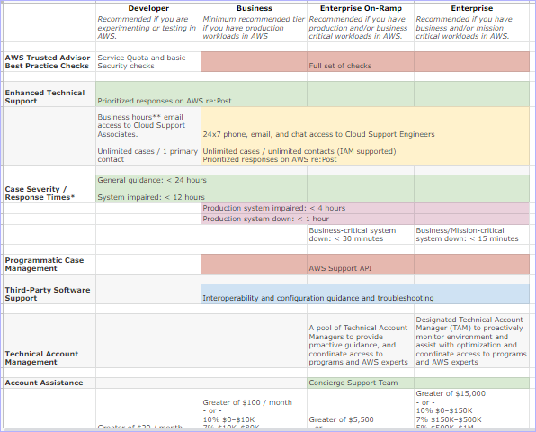

# Support Plans
Amazon provides access to extra expertise to support users of AWS at at a free Basic Support plus four additional tiered pay plans. Support plans are to help users optimize performance, manage risk, and keep costs under control.

Basic Support which is automatically included for all AWS customers include: 

**Customer Service and Communities** - 24x7 access to customer service, documentation, whitepapers, and AWS re:Post.

**AWS Trusted Advisor** - Access to core Trusted Advisor checks and guidance to provision resources following best practices to increase performance and improve security.

**AWS Personal Health Dashboard** - A personalized view of the health of AWS services, and alerts when resources are impacted.

The following chart shows the extra support services provided for paid AWS Support Plans.

### References
https://aws.amazon.com/premiumsupport/plans/
