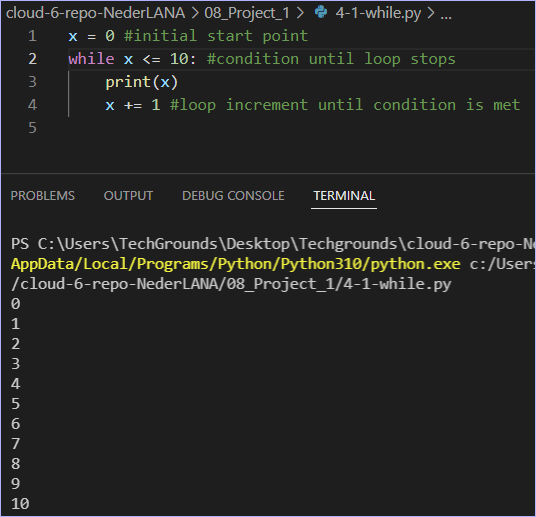
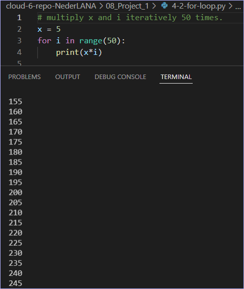
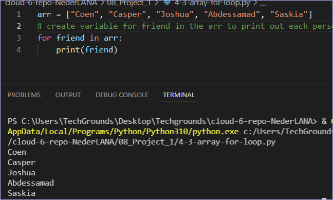

# Loops

You can use loops when you want to run a block of code multiple times. For example, you might want to do an operation on every item in a (large) list, or you want to write an algorithm that follows the same set of instructions for multiple iterations.

There are two types of loops in Python: the **while loop** and the **for loop**.
* The while loop runs while a condition is true. They can run indefinitely if that condition never changes. If your code is stuck in an infinite loop, just press ctrl+c to force quit the running code.
* The for loop runs for a predetermined number of iterations. This number can be hard coded using the range() function, or dynamically assigned (using a variable, the size of a list, or the number of lines in a document. It is also possible to accidentally create an infinite for-loop. You can use the same command (ctrl+c) to exit your program.

Lists of questions for theoretical research:
What is X for?
How does X fit / replace X in a classical setting?
How can X be combined with other services?
What is the difference between X and other similar programs?

## Key-terms

## Assignment
Exercise 1:
- Create a new script.
- Create a variable x and give it the value 0.
- Use a while loop to print the value of x in every iteration of the loop. After printing, the value of x should increase by 1. The loop should run as long as x is smaller than or equal to 10.
- Be careful of infinite loops!

Exercise 2: 
- Create a new script.
- Copy the code below into your script.
    for i in range(10):    
    # do something here
- Print the value of i in the for loop. You did not manually assign a value to i. Figure out how its value is determined.
- Add a variable x with value 5 at the top of your script.
- Using the for loop, print the value of x multiplied by the value of i, for up to 50 iterations.

Exercise 3:
- Create a new script.
- Copy the array below into your script.
arr = ["Coen", "Casper", "Joshua", "Abdessamad", "Saskia"]
- Use a for loop to loop over the array. Print every name individually.

### References

### Issues

### Results

Ex1: While loops. Print value incrementally until x <= 10

Ex2: For i in range(10): print(i). For loop is ideal to return the contents of a list, iteratively. As the range is hard-coded up to 10, the list returns the values in order from 0-9, then stops.

Now multiply an x variable with i 50 times, iteratively.

Ex3: Use for loop to loop over an array iteratively
