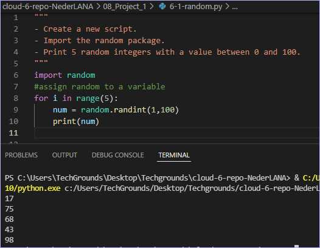
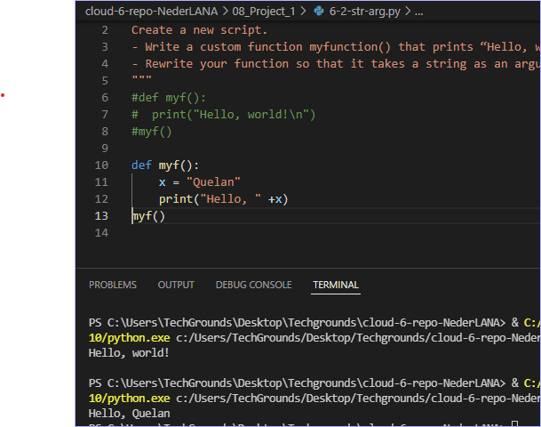
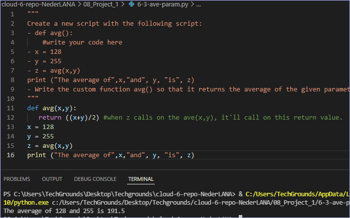

# Functions
You’ve already seen and used a couple of functions, like print() and input(). A function is a block of code that only runs when it is called. Functions are recognizable by the brackets () next to the function name. These brackets serve as a place to input data into a function. Functions can return data as a result.

Besides the built-in functions, you can also write custom functions, or import functions from a library or package.

Lists of questions for theoretical research:
What is X for?
How does X fit / replace X in a classical setting?
How can X be combined with other services?
What is the difference between X and other similar programs?

## Assignment
Exercise 1:
- Create a new script.
- Import the random package.
- Print 5 random integers with a value between 0 and 100.

Exercise 2:
- Create a new script.
- Write a custom function myfunction() that prints “Hello, world!” to the terminal. Call myfunction.
- Rewrite your function so that it takes a string as an argument. Then, it should print “Hello, <string>!”.

Exercise 3:
- Create a new script.
- def avg():
    #write your code here
- x = 128
- y = 255
- z = avg(x,y)
print ("The average of",x,"and", y, "is", z)
- Write the custom function avg() so that it returns the average of the given parameters.

### References

### Results

Ex1: Print random number five times using a for loop.

Ex2: Pass string to custom def function

Ex3: Return the average value of two variables.
