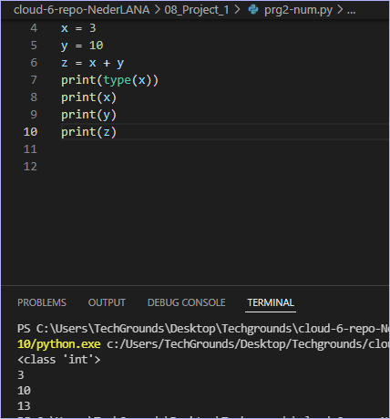
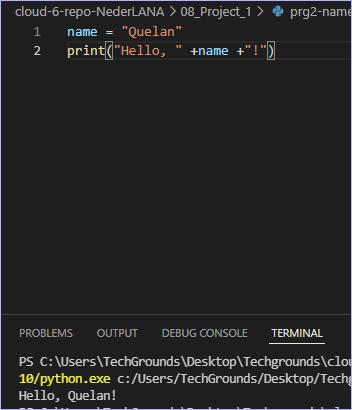
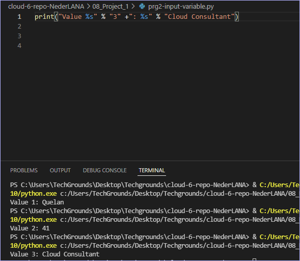

# Variables

A variable can store a value. This value can then be accessed with the variable name in the code. This is useful when one value is used repeatedly or if it is necessary to dynamically change the value.
A variable thus replaces the necessity of hard coding every value. And allows the possibility to provide the handling of future or unknown values.

A variable name can be any string of characters (except for some special cases that are reserved for other use). It is a best practice to use variable names that are short, but also clear. For example, a variable that stores user input might be named input or usr_inpt.

*Remember that at any time in the code, put a print statement in order to read the current value of a variable. This is useful when trying to find a bug in a script.*

How can X be combined with other services?

## Key-terms

## Assignment
Exercise 1:
Create a new script.
Create two variables x and y. Assign a numerical value to both variables.
Print the values of x and y.
Create a third variable named z. The value of z should be the sum of x and y.
Print the value of z.
*Print type of value to verify variable type.*

Exercise 2:
Create a new script.
Create a variable name. The value of name should be your name.
Print the text “Hello, <your name here>!”. Use name in the print statement.

Exercise 3:
Create a new script.
Create a variable and assign a value to it.
Print the text “Value 1: <value 1 here>”.
Change the value of that same variable.
Print the text “Value 2: <value 2 here>”.
Change the value of that same variable.
Print the text “Value 3: <value 3 here>”.

### References
ex1:
https://code.visualstudio.com/docs/python/python-tutorial

ex2:
https://www.youtube.com/watch?v=dHcCbxTfwoU

ex3: 
https://www.youtube.com/watch?v=4Cu4WBFIEjQ

### Issues

### Results

Ex1:

Ex2:

Ex3: 
