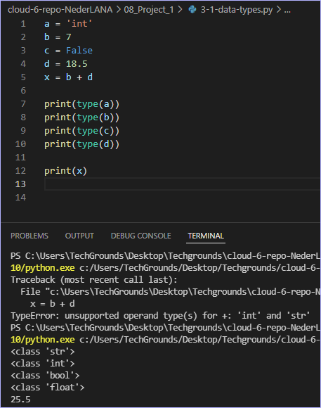
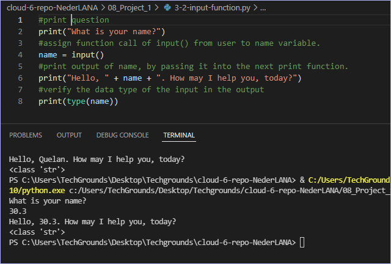

# Data Types and Comments
Under the hood, a computer can only see strings of zeros and ones. Programming languages make use of data types to tell the computer how to interpret those strings.For example, when the computer needs to read the binary string 01000001, it will need to know the data type to determine whether it means 65 or “A”.

This is a non exhaustive list of some important data types in Python:

* Boolean
A binary state that is either True or False.

* String
Technically an array of characters. Strings are denoted using “ ” double quotes or ‘ ’ single quotes.

* int
An integer is a whole number. Ints can be both positive and negative.

* float
A floating-point number is a decimal number.

***Comments** are lines that do not get processed as code. This can be used for multiple purposes. For example, you can write a short description of what a block of code does. You can also ‘comment out’ some code, so that it is temporarily removed. This can be useful for testing and debugging.*

## Assignment
Exercise 1:

- Create a new script.
- Copy the code below into your script.

    a = 'int'

    b = 7

    c = False

    d = "18.5"

- Determine the data types of all four variables (a, b, c, d) using a built in function.
- Make a new variable x and give it the value b + d. Print the value of x. This will raise an error. Fix it so that print(x) prints a float.
- Write a comment above every line of code that tells the reader what is going on in your script.

Exercise 2:

- Create a new script.
- Use the input() function to get input from the user. Store that input in a variable.
- Find out what data type the output of input() is. See if it is different for different kinds of input (numbers, words, etc.).

### References
https://www.youtube.com/watch?v=2n3EDW31n-s

### Results

Ex1:
-determine data types of all four variables

-print x as a float
d is given as a string, but by removing "" marks, it is converted to a float data type, and there's no conflict to run the script.

-make comments in .py script 

Ex2:
Assign input function to a variable. Then pass the output of the variable to another print function of string concatenation.
This is the foundation for building complex applications. This is now a dynamic program based on differing input (from the user, from a database, etc). 
