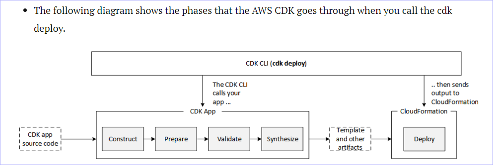

## AWS CDK with CLI

Although AWS CloudFormation parameters can be defined in the AWS CDK, they are generally discouraged because AWS CloudFormation parameters are resolved only during deployment. This means that you cannot determine their value in your code. For example, to conditionally include a resource in your app based on the value of a parameter, you must set up an AWS CloudFormation condition and tag the resource with this condition. Because the AWS CDK takes an approach where concrete templates are resolved at synthesis time, you can use an if statement to check the value to determine whether a resource should be defined or some behavior should be applied.
- https://docs.aws.amazon.com/cdk/v2/guide/stacks.html

- https://www.ernestchiang.com/en/notes/aws/cdk/

