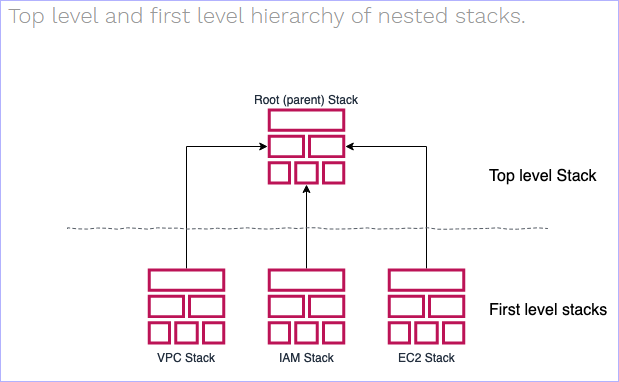
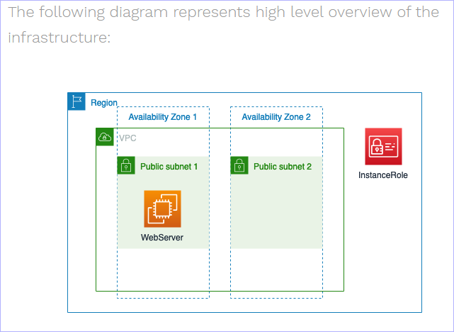

# Cinco Outline

Deliverables:
The following deliverables are expected in the GitHub repository at the end of this project:
- A working CDK *.py document (starting)
- Design Documentation *diagram (in progress-to complete in prezi)
- Decision Documentation .md (in progress)
- Time logs (still must start this)
- Final presentation (later on prezi)
---
# Design Decisions
There will be 2 VPC’s with two public subnets in different AZ’s within a region.
Multi-VPC architecture will allow you to isolate different parts of your infrastructure.
Furthermore to achieve high availability, it is good practice to deploy service to at least two AZ’s. If one AZ goes down there will always be another to take over.( This is out of our project scope)

**VPC Peering Connection**
With peering, the servers in different VPC’s can talk to each other via private IP.

**Web Server**
Web server will get installed automatically by providing User Data while launching EC2 Instance.
It will be kept in a public subnet with public and private ip’s provided.
The root volume (EBS) will be encrypted and the key will be stored in AWS KMS.
The web server will need Security Group rules that allow inbound HTTP and HTTPS access.This will ensure web server access via the Public DNS IP or Public IP.
For SSH connection, Management server’s source ip will be used.
AWS Backup will allow you to take backups daily and to maintain it for a required number of days.

**Management Server**
The management server will have port 22 open for SSH connection from trusted locations.
The root volume (EBS) will be encrypted and the key will be stored in AWS KMS.
The IAM Role will be created which will then be attached to the EC2 instance. This will ensure limited user access to the management server.
AWS Backup will allow you to take backups daily and to maintain it for a required number of days.

**S3 storage**
Bootstrap Scripts will be in S3 bucket.
The bucket will be encrypted with a key stored in KMS.

CDK constructs allow you to bundle up a bunch of infrastructure into reusable components which anyone can compose into their apps.

1 cdk application with multiple stacks
- Sharing VPCs between stacks
If you are creating multiple Stacks inside the same CDK application, you can reuse a VPC defined in one Stack in another by simply passing the VPC instance around:

management server (configures and deploys VM)
When code is pushed to a repository and passes code review, it’s picked up by a shared services account, where your delivery pipeline is configured. That account is responsible for building, testing, and deploying your application to target environments, such as beta, gamma, and prod, each of which is hosted in its own isolated account.

### References

cdk python workshop:
https://cdkworkshop.com/30-python.html

cdk project structure
https://aws.amazon.com/blogs/developer/recommended-aws-cdk-project-structure-for-python-applications/

cdk best practices:
https://aws.amazon.com/blogs/devops/best-practices-for-developing-cloud-applications-with-aws-cdk/

scheduled cloudwatch task:
https://github.com/aws/aws-cdk/blob/master/design/aws-ecs/aws-ecs-scheduled-ecs-task-construct.md

create cdk construct tree:
https://github.com/aws/aws-cdk/blob/master/design/construct-tree.md

### Issues

### Results

