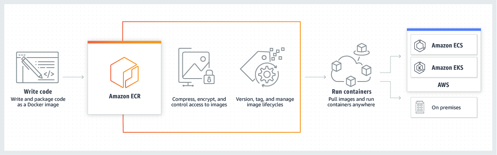

AWS Security Groups

### Stateful firewall 
-monitor all aspects of the traffic streams, their characteristics and communication channels. These firewalls can integrate encryption or tunnels, identify TCP connection stages, packet state and other key status updates.

### Stateless firewall
-one of the earlier iterations of firewalls, stateless only focus on individual packets, using preset rules to filter traffic, and often does not look beyond packet headers to decide if it might be truly desired communications. Is cheaper and can handle high traffic.

---
AWS Shared Responsibility Model

### Inherited Controls
– Controls which a customer fully inherits from AWS.
* Physical and Environmental controls

### Shared Controls
– Controls which apply to both the infrastructure layer and customer layers, but in completely separate contexts or perspectives. In a shared control, AWS provides the requirements for the infrastructure and the customer must provide their own control implementation within their use of AWS services. Examples include:

* Patch Management – AWS is responsible for patching and fixing flaws within the infrastructure, but customers are responsible for patching their guest OS and applications.

* Configuration Management – AWS maintains the configuration of its infrastructure devices, but a customer is responsible for configuring their own guest operating systems, databases, and applications.

* Awareness & Training - AWS trains AWS employees, but a customer must train their own employees.

### Customer Specific Controls
– Controls which are solely the responsibility of the customer based on the application they are deploying within AWS services. Examples include:

* Service and Communications Protection or Zone Security which may require a customer to route or zone data within specific security environments.
---

CloudFront CDN

### Edge Location
- the location where the content will be cached. It is a separate to an AWS Region or AWS availability zone.

### Origin
- the origin of all the files that CDN will distribute. Origin can be either an S3 bucket, an EC2 instance or an Elastic Load Balancer.

### Distribution
- name given to the CDN which consists of a collection of edge locations. When we create a new CDN in a network with aws means that we are creating a Distribution. Distribution may be:

* Web Distribution typically used for websites.

* RTMP used for media streaming.

---

Elastic File System

### Mount Target
- mount targets must be created in VPC in order to access file system. Must have:

### Access Points
- Any file system request using the access point applies an operating user, group, and file system path. This ensures each application always uses the correct operating system identity and the correct directory when accessing shared file-based datasets. Applications using the access point can only access data in its own directory and below. 

### Security Groups
- A security group acts as a virtual firewall for EC2 instances to control inbound and outbound traffic. When an EC2 instance is launched in a VPC, up to five security groups can be assigned to the instance. Security groups act at the instance level, not the subnet level. Therefore, each instance in a subnet can be assigned to a different set of security groups.

### DataSync
- data transfer service that moves and replicates data via the internet or via AWS Direct Connect. Transfers file data and file system metadata.

---

RDS and Aurora

### Aurora Read Replica
- To increase availability, Aurora automatically sets up replication from the writer DB instance to all the other DB instances. These other DB instances are read-only and are known as Aurora Replicas. 

---

Lambda

### Handler
- can specify a handler (a method/function in code) where AWS Lambda can begin executing code. AWS Lambda provides event data as input to this handler, which processes the event.

---

Elastic Container Service

### Elastic Container Registry 
- ECR is an AWS managed container image registry service integrated with ECS. Customers can use the familiar Docker CLI, or their preferred client, to push, pull, and manage Docker or OCI images. 

### Elastic Kubernetes Service
- EKS is a cloud-based container management service that natively integrates with Kubernetes to deploy applications. With Amazon EKS, an enterprise can use Kubernetes without having install, operate or manage the container orchestration software in the EC2 instances.

### Fargate
- a serverless technology to be used with Amazon ECS and EKS to run containers without having to manage servers or clusters of Amazon EC2 instances. With Fargate, it is no longer necessary to provision, configure, or scale clusters of virtual machines to run containers. 

